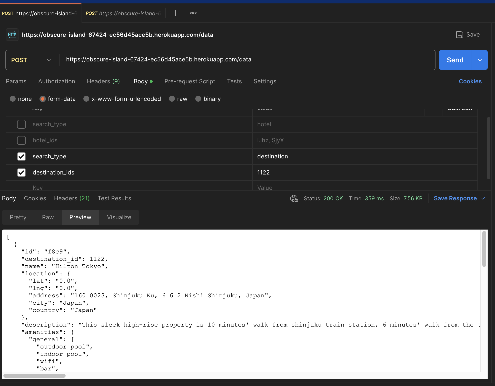

- [README](#readme)
- [Demo](#demo)
  - [With Browser](#with-browser)
  - [With Local Development](#with-local-development)
  - [Testing Endpoint With POSTMAN](#testing-endpoint-with-postman)
- [Architecture](#architecture)
  - [Database](#database)
    - [Why use relational compared to non-relational database?](#why-use-relational-compared-to-non-relational-database)
  - [Deployment](#deployment)
- [Code Design](#code-design)
  - [Database Entities](#database-entities)
    - [Hotel](#hotel)
    - [HotelImages](#hotelimages)
    - [Facilities](#facilities)
    - [Locations](#locations)
- [Custom Classes](#custom-classes)
- [Model](#model)
- [Data Sources](#data-sources)
- [Other Sources](#other-sources)

# README

This application is meant to address the assignment details provided. As mentioned in the problem statement, the focus is on cleaning and merging data together and ensure uniqueness of the hotel data stored.


# Demo

The main endpoint to call and filter on the finalized data based on either `hotel` id or `destination` id can be found here:
```
post "/data", to: 'home#data', as: 'data'
```

I decided to use **POST** instead of **GET** to cater for url size limits in the event where large number of ids are passed in the request. Also, **POST** is a bit neater to deal with as seen in the following section described with using **POSTMAN**.

## With Browser

I have deployed the application to the web. You can access it [here](https://obscure-island-67424-ec56d45ace5b.herokuapp.com).

The homepage of the app looks something like this:


- Clear all data - clears all the data in the database
- Get links - retrieve the data via HTTP requests from the specified source
- Filter buttons - type in the ids separated by commas to filter the data

Check out the sample demo:


## With Local Development

Steps:
1. Clone the repo
2. Run the following commands in order (assumes that you have rails installed):
```
rails db:create
rails db:migrate
rails s
```
visit http://127.0.0.1:3000


## Testing Endpoint With POSTMAN

You can download POSTMAN [here](https://www.postman.com/downloads/).



As seen from the picture, we just need to set the values for `search_type` and either `hotel_ids` or `destination_ids`, depending on what you are searching for. Then press send and you should receive the response in POSTMAN.

Accepted values:
- search_type => 'hotel' or 'destination'
- hotel_ids, destination_ids => values separated by comma, e.g iJhz, SjyX

urls:
- local: http://127.0.0.1:3000
- browser: https://obscure-island-67424-ec56d45ace5b.herokuapp.com

# Architecture

## Database

Local development - sqlite3, Production - PostgreSql. No specific reason for one over the other, Sqlite3 is good as a lightweight database but unfortunately Heroku with Rails works better with Postgresql so I went with that for deployment.

### Why use relational compared to non-relational database?

It seems like we are serving merged data in a consistent manner. Even the data sources are unstructured, our site that presents that finalized data should be structured. Also, with relational database, we can make use of traditional indexing strategies for optimizations.


## Deployment

Heroku, no automation set up for this. I've chose Heroku because it is the most familiar to me for Rails deployment.

References:
- [Deployment with Rails 7](https://devcenter.heroku.com/articles/getting-started-with-rails7)
- [Postgres / Sqlite3 Error](https://devcenter.heroku.com/articles/sqlite3#getting-a-sqlite-error-even-though-it-is-not-in-the-gemfile)


# Code Design

## Database Entities


### Hotel
This is the main entity. Instead of using the name `hotel_id`, I opted for `ref_id` because rails is "convention over configuration", and the name `hotel_id` is generated and used automatically when we define relationships between models.

### HotelImages
One hotel can have many images, but each image can only belong to one hotel.

Hence, it is a one-to-many relationship.

### Facilities
Each hotel can have various facilities and each facility can be found in various hotels.

Hence, it is a many-to-many relationship.

One thing to note here is that I opted to use `has_many through`.
```
has_many :facility, through: :hotel_facilities, dependent: :destroy
```

This is so that we can define the `HotelFacilities` model, allowing for better clarity and control. By default, this table will still be created but we will not be able to interact with it easily without a model.

Sources:
- has_many_through https://www.brainstobytes.com/quick-tips-how-to-create-many-to-many-associations-in-rails/
- has many through vs https://stackoverflow.com/questions/285456/how-to-insert-rows-when-using-a-many-to-many-relation

### Locations
Each hotel can only have one location and each location only belongs to one hotel.

Hence, it is a one-to-one relationship.

Lat and long are stored as decimal with precision: 10 and scale: 6. This is the advised standard to follow when storing lat and long. Floats should not be used because it is not precise.

Sources:
- lat and long standard - https://medium.com/technically-speaking/rails-and-geographic-coordinates-57ca87438888


# Custom Classes

`lib/base_parser.rb` - contains the base logic shared across the 3 sources.

For individual differences between the sources, each of its own files `paper_files.rb`, `patagonia.rb`, `acme.rb` contains its own set of logic.

`string_utils.rb` - contains static implementation of helper methods.

# Model

Most of the repeated obj creation logic are stored in the model files.

# Data Sources

Each data sources has sections that is better than the others.

`paperFiles` (main source) - amenities, images, booking_conditions (the only one that has it). 

`patagonia` - hotel info for this seems better so if this source is called, it will overwrite the base description.

`acme` - postal_code (the only one that has specific postal code)


# Other Sources
- ffmpeg convert mov to gif - https://gist.github.com/SheldonWangRJT/8d3f44a35c8d1386a396b9b49b43c385?permalink_comment_id=4030937